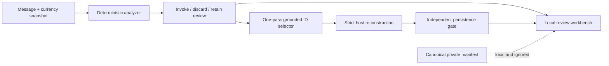

# PocketFinancer SMS Processing and Model Research

[](https://github.com/ManishAradwad/pF_slm_selection/actions/workflows/ci.yml)
[](https://www.python.org/)
[](https://github.com/ManishAradwad/pocket-financer-android)

This repository contains PocketFinancer's active platform-neutral SMS-processing
foundation and the historical small-language-model research that led to it. The
active path preserves source evidence, applies one deterministic analyzer, invokes
one non-thinking Grounded Candidate Selector pass when appropriate, reconstructs
the result on the host, and independently decides whether automatic persistence is
safe.

```json
{"decision":"posted","amount":"amt_…","direction":"dir_…","account":"acc_…","counterparty":"cp_…"}
```

The model selects IDs only. Exact money, currencies, direction semantics, optional
field state, dates, and UTF-8 spans remain host responsibilities. Android and iOS
have not yet integrated the shared foundation. Their existing contracts remain
historical/native-parity evidence until that separate integration is planned and
implemented.

## Active status

The complete private archive has been rebuilt into one ignored canonical manifest:

- 17,830/17,830 source rows represented exactly once;
- zero source-ID, exact-body, normalized-template, or sender-template overlap
  across protected pools;
- all 15 mapped legacy positives avoid deterministic discard;
- no final SFT targets were generated;
- the local SQLite workbench contains the complete manifest and has a verified
  hash-recorded backup.

The current analyzer pass is deliberately conservative: 1,456 rows are normal
selector invocations, 125 are assistive review invocations, and 16,249 skip the
model. These are weak operational suggestions, not truth.

Start with the [SMS Processing Architecture](docs/architecture/SMS_PROCESSING_ARCHITECTURE.md),
[Grounded Candidate Selector Contract](docs/contracts/GROUNDED_CANDIDATE_SELECTOR_CONTRACT.md),
and [active execution plan](docs/plans/SMS_PROCESSING_EXECUTION_PLAN.md).

## Historical model evidence

As of 2026-08-08, the three-seed Candidate Protocol V1 comparison is complete.
It improved transaction extraction substantially on every seed but failed its
false-positive safety requirement on every seed. No result supports deployment.

### Candidate Protocol V1 controlled run

The selector emits compact candidate IDs and leaves exact decimal handling,
source validation, reconstruction, and transaction dating to deterministic host
code. It was compared with direct four-field generation using the same locked
350M model, 152/29 silver split, and seeds 17/29/43.

| Seed | Direct transaction exact / FP | Selector transaction exact / FP |
|---:|---:|---:|
| 17 | 13/114 / 0 | 60/114 / 1 |
| 29 | 47/114 / 0 | 62/114 / 1 |
| 43 | 6/114 / 0 | 59/114 / 1 |

All accepted selector transactions were strict-schema-valid and source-grounded.
The declared gate nevertheless failed because selector false positives had to be
no greater than direct on every seed. The 203 evaluation rows are reused
diagnostics, not fresh human gold; Android/iOS runtime parity remains unverified.
Read the [controlled run report](docs/experiments/POCKETFINANCER_LFM25_350M_CANDIDATE_PROTOCOL_V1.md)
for the evidence, packaging audit, and explicit non-promotion decision.

### Historical 350M run

The first unified Android-aligned `LiquidAI/LFM2.5-350M` LoRA run trained on the
local RTX 4070, exported BF16/Q8/Q4 GGUFs, and evaluated the Q4 artifact through
the app prompt, prefilter, and parser profile.

| Variant | Whole-pipeline exact | Transaction exact |
|---|---:|---:|
| Untuned 350M, HF proxy | 89/203 (43.84%) | 0/114 |
| LoRA adapter, HF proxy | 121/203 (59.61%) | 32/114 (28.07%) |
| Merged BF16 GGUF | 122/203 (60.10%) | 33/114 (28.95%) |
| Q4_K_M, current tokenization | 120/203 (59.11%) | 31/114 (27.19%) |
| Q4_K_M, single-BOS diagnostic | 125/203 (61.58%) | 36/114 (31.58%) |

The pipeline works; the model is not ready to ship. Counterparty selection and
missed transactions remain the main weaknesses. The single-BOS result is a
directional diagnostic, not a statistically decisive Android change.

These 203 rows are a repeatedly consulted regression fixture, not a fresh test.
Read the [complete run report](docs/experiments/POCKETFINANCER_A9_LORA_R16_S17.md)
and [experiment catalog](docs/experiments/EXPERIMENT_CATALOG.md) before comparing
scores.

### 2.6B diagnostics

| Variant | App-interpreted whole exact | App-interpreted transaction exact |
|---|---:|---:|
| Untouched Post, HF | 174/203 | 86/114 |
| Untouched Base, HF | 186/203 | 98/114 |
| Selected LoRA, HF | 184/203 | 96/114 |
| Tuned BF16 GGUF, single BOS | 184/203 | 96/114 |
| Tuned Q8 GGUF, single BOS | 184/203 | 96/114 |
| Tuned Q4 GGUF, Android-current | 166/203 | 78/114 |
| Tuned Q4 GGUF, single BOS | 173/203 | 85/114 |

Every row above uses the same reused 203-row regression fixture; it is not a
fresh test. HF and GPU timings are not Android timings. The Android-current Q4
result uses the profile's actual declared duplicate-BOS behavior, while the
single-BOS rows are diagnostics.

Untouched Base beat untouched Post. The small 154-train/29-dev silver-data LoRA
did not reliably beat Base. Q8 preserved tuned HF/BF16 parity, while Q4 lost
quality. Single BOS recovered seven whole-pipeline and seven transaction exact
rows relative to Android-current Q4, but the Android source and device-behavior
decision remains open. See the
[completed 2.6B report](docs/experiments/POCKETFINANCER_LFM25_2_6B_R16_S17.md)
for the controlled comparisons and limitations.

## Active system overview



The architecture distinguishes three product facts:

- the model recognized a posted event;
- the host reconstructed a valid semantic result;
- the result passed every automatic-persistence safety gate.

The processing trace can expose real analyzer cues/candidates, compact JSON token
decoding, raw model output, validation, reconstruction, and persistence reasons.
It must not fabricate or expose chain of thought.

## Active local workflow

```bash
python scripts/run_sms_processing.py build-corpus
python scripts/run_sms_processing.py init-workbench
python scripts/run_sms_processing.py serve-workbench
python scripts/run_sms_processing.py backup-workbench
python scripts/run_sms_processing.py export-workbench
```

The workbench binds only to `127.0.0.1`, uses no remote assets/API/telemetry, and
stores all state below ignored `PRIVATE_DATA/sms_processing`. Do not tunnel or
screen-share private review rows.

## Historical model-research workflow

Development happens in the native WSL2 checkout, not in a duplicated NTFS clone:

```bash
cd /home/tojinotzenin/pF_slm_selection
source scripts/activate_wsl.sh

# Choose the 350M or 2.6B Base declaration.
PIPELINE_CONFIG=configs/pipelines/pocketfinancer-lfm2.5-350m.json
# PIPELINE_CONFIG=configs/pipelines/pocketfinancer-lfm2.5-2.6b-base.json

# Read-only readiness and provenance verification.
python scripts/run_pocketfinancer_pipeline.py check --config "$PIPELINE_CONFIG"

# Display the exact commands without executing a stage.
python scripts/run_pocketfinancer_pipeline.py plan --config "$PIPELINE_CONFIG"
```

The supported pipeline declarations are the
[`350M profile`](configs/pipelines/pocketfinancer-lfm2.5-350m.json) and
[`2.6B Base profile`](configs/pipelines/pocketfinancer-lfm2.5-2.6b-base.json).
The CLI defaults to 350M; pass `--config` to select either declaration explicitly.
Run expensive work one stage at a time:

| Stage | Purpose |
|---|---|
| `build-data` | Build app-filtered, source-grounded private train/dev rows |
| `evaluate-base-hf` | Score the untouched locked model before training |
| `train` | Train completion-only LoRA using the exact app messages |
| `evaluate-hf` | Run the selected-adapter HF diagnostic |
| `merge` | Merge the selected adapter into the locked base |
| `convert` | Export reference and deployable GGUF quantizations |
| `evaluate-gguf` | Score the deployable GGUF under the app profile |

```bash
python scripts/run_pocketfinancer_pipeline.py build-data --config "$PIPELINE_CONFIG"
python scripts/run_pocketfinancer_pipeline.py evaluate-base-hf --config "$PIPELINE_CONFIG"
python scripts/run_pocketfinancer_pipeline.py train --config "$PIPELINE_CONFIG"
python scripts/run_pocketfinancer_pipeline.py evaluate-hf --config "$PIPELINE_CONFIG"
python scripts/run_pocketfinancer_pipeline.py merge --config "$PIPELINE_CONFIG"
python scripts/run_pocketfinancer_pipeline.py convert --config "$PIPELINE_CONFIG"
python scripts/run_pocketfinancer_pipeline.py evaluate-gguf --config "$PIPELINE_CONFIG"
```

`all` is available for intentional automation, but stage-by-stage execution makes
artifact inspection and failure recovery safer.

## Development setup

### Lightweight, model-free checks

CI intentionally avoids Torch, CUDA, model downloads, and private artifacts:

```bash
python3.11 -m venv /tmp/pf-slm-ci
source /tmp/pf-slm-ci/bin/activate
python -m pip install -r requirements-ci.txt
python scripts/check_repo_safety.py
python -m ruff check .
python -m ruff check --select E4,E7,E9,F lfm25 src scripts tests
python -m pytest -q
```

### Full local ML environment

The prepared WSL machine uses Python 3.11 and an RTX 4070 with 12 GB VRAM:

```bash
bash scripts/setup_wsl.sh
source scripts/activate_wsl.sh
python scripts/verify_gpu.py
python scripts/verify_lfm25_backward.py
```

See [CONTRIBUTING.md](CONTRIBUTING.md) for change-specific verification and
[scripts/README.md](scripts/README.md) for the complete command map.

## Repository map

```text
configs/
  sms_processing/  active schemas, currency table, profiles, archive run
  contracts/       historical/native prompt/runtime/parser profiles
  pipelines/       app-facing experiment declarations
  models/          candidate model records
docs/
  architecture/    stable boundaries and improvement roadmap
  experiments/     dated evidence and the canonical catalog
  guides/          fine-tuning and conceptual guides
src/pocketfinancer_sms/ active analyzer, triage, selector, corpus, workbench
lfm25/              historical model-research and compatibility package
scripts/            CLI entry points, safety checks, training and conversion
tests/              lightweight unit, contract, provenance and safety tests
DATA/               grandfathered regression task assets
```

Local/generated roots are intentionally absent from the tracked map:

| Ignored root | Contents |
|---|---|
| `PRIVATE_DATA/` | Raw archive, canonical runs, labels, workbench, backups/exports |
| `PUBLIC_CANDIDATE/` | Unreleased public-dataset candidates and audits |
| `MODELS/` | Downloaded model, tokenizer, and GGUF files |
| `TRAINING_ARTIFACTS/` | Adapters, checkpoints, merged weights, conversion output |
| `RESULTS/` | Aggregate metrics and private per-row predictions |
| `UPSTREAM/` | Pinned local external source trees such as llama.cpp |

The `lfm25` package remains for artifact/import compatibility and measured
historical provenance. New SMS behavior belongs in `src/pocketfinancer_sms`.

## Data and evaluation rules

- Private financial messages stay local. Do not send them to hosted APIs,
  telemetry, remote labeling, cloud inference, or experiment trackers.
- Never commit raw SMS, identifiers, private mappings, per-row output, adapters,
  weights, checkpoints, or GGUF files.
- `DATA/extraction_ds.jsonl` is locked as a reused regression fixture. Do not train
  on it or use it for a fresh production claim.
- Weak and silver labels are not human gold. Preserve label source, confidence, grounding,
  split policy, and hashes.
- Any future training data must be source-grounded and template-component-disjoint across
  train, tuning, and fresh test boundaries.
- Grammar state, BOS handling, quantization, parser interpretation, and runtime
  must be explicit in every result.
- Repository work does not authorize publishing a dataset, model, or application
  artifact.

Run `python scripts/check_repo_safety.py` before every commit. It is a pathname
guard, not a substitute for reviewing content and diffs.

## Documentation

- [Documentation index](docs/README.md)
- [Agent/tool-neutral repository rules](AGENTS.md)
- [Contribution and pull-request workflow](CONTRIBUTING.md)
- [Command map](scripts/README.md)
- [SMS Processing Architecture](docs/architecture/SMS_PROCESSING_ARCHITECTURE.md)
- [Grounded Candidate Selector Contract](docs/contracts/GROUNDED_CANDIDATE_SELECTOR_CONTRACT.md)
- [Workbench Requirements and Data Flow](docs/architecture/WORKBENCH_REQUIREMENTS_AND_DATA_FLOW.md)
- [SMS Processing Decision Log](docs/architecture/SMS_PROCESSING_DECISION_LOG.md)
- [Candidate Protocol V1 controlled run](docs/experiments/POCKETFINANCER_LFM25_350M_CANDIDATE_PROTOCOL_V1.md)
- [Completed 2.6B diagnostic report](docs/experiments/POCKETFINANCER_LFM25_2_6B_R16_S17.md)
- [Historical 350M Android-aligned run](docs/experiments/POCKETFINANCER_A9_LORA_R16_S17.md)
- [Experiment and dataset catalog](docs/experiments/EXPERIMENT_CATALOG.md)
- [Fine-tuning, LoRA, and QLoRA primer](docs/guides/FINE_TUNING_PRIMER.md)
- [Model-improvement roadmap](docs/architecture/MODEL_IMPROVEMENT_ROADMAP.md)
- [LFM2.5-2.6B pre-run evaluation plan (provenance)](docs/experiments/LFM25_2_6B_EVALUATION_PLAN.md)

## Next decision gates

1. Use the workbench to rebuild operational segregation and canonical human truth
   from the annotation-training/development pools.
2. Measure candidate-oracle failures and reduce retain-review through reviewed,
   provenance-bound analyzer/profile changes.
3. Plan Android/iOS integration for currency snapshots, retain-review assistance,
   grounded selector decoding, processing traces, feedback, and safe persistence.
4. Freeze the pipeline before blind protected-test/later-time evaluation.
5. Only then build training targets, select a model, and run native-device gates.

## Contributing

Use a focused branch and pull request, Conventional Commit title, exact verification
evidence, and the repository PR template. Read [AGENTS.md](AGENTS.md) first. No
merge or code review decision should rely on a result that hides its data boundary,
parser behavior, or runtime-parity limitation.
