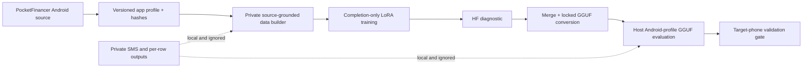

# PocketFinancer SLM Selection and Fine-Tuning

[](https://github.com/ManishAradwad/pF_slm_selection/actions/workflows/ci.yml)
[](https://www.python.org/)
[](https://github.com/ManishAradwad/pocket-financer-android)

This repository develops, fine-tunes, converts, and evaluates small language
models for PocketFinancer's on-device financial SMS extraction pipeline. The
target behavior is deliberately narrow: after the Android app's deterministic
filter, produce either literal `null` or one four-field transaction object.

```json
{
  "amount": "1500.00",
  "counterparty": "Example merchant",
  "type": "debit",
  "account": "A/c XX1234"
}
```

PocketFinancer Android is the product source of truth. In this project, the word
**contract** simply means the exact app-facing behavior that must stay aligned:
filter, prompt/messages, GGUF chat template, context and decoding, output parser,
and metrics interpretation. The current versioned record is
[`configs/contracts/pocketfinancer-android-current.json`](configs/contracts/pocketfinancer-android-current.json).

## Current status

The first unified Android-aligned `LiquidAI/LFM2.5-350M` LoRA run is complete. It
trained on the local RTX 4070, exported BF16/Q8/Q4 GGUFs, and evaluated the Q4
artifact through the app prompt, prefilter, and parser profile.

| Variant | Whole-pipeline exact | Transaction exact |
|---|---:|---:|
| Untuned 350M, HF proxy | 89/203 (43.84%) | 0/114 |
| LoRA adapter, HF proxy | 121/203 (59.61%) | 32/114 (28.07%) |
| Merged BF16 GGUF | 122/203 (60.10%) | 33/114 (28.95%) |
| Q4_K_M, current tokenization | 120/203 (59.11%) | 31/114 (27.19%) |
| Q4_K_M, single-BOS diagnostic | 125/203 (61.58%) | 36/114 (31.58%) |

The pipeline works; the model is not ready to ship. Counterparty selection and
missed transactions remain the main weaknesses. The single-BOS result is a
directional diagnostic, not a statistically decisive Android change.

These 203 rows are a repeatedly consulted regression fixture, not a fresh test.
Read the [complete run report](docs/experiments/POCKETFINANCER_A9_LORA_R16_S17.md)
and [experiment catalog](docs/experiments/EXPERIMENT_CATALOG.md) before comparing
scores.

## System overview



The pipeline reports two distinct views where applicable:

- **App-interpreted metrics** mirror PocketFinancer's fail-closed parser and are
  the primary product-facing score.
- **Strict raw-output metrics** reveal malformed or schema-invalid generation that
  the app safely collapses to `null`.

HF evaluation is a fast training proxy. Desktop `llama-cpp-python` GGUF evaluation
is closer to deployment but is still not the app's custom JNI runtime or phone
hardware. A deployment claim requires an instrumented Android-device run.

## Canonical workflow

Development happens in the native WSL2 checkout, not in a duplicated NTFS clone:

```bash
cd /home/tojinotzenin/pF_slm_selection
source scripts/activate_wsl.sh

# Read-only readiness and provenance verification.
python scripts/run_pocketfinancer_pipeline.py check

# Display the exact commands without executing a stage.
python scripts/run_pocketfinancer_pipeline.py plan
```

The supported pipeline declaration is
[`configs/pipelines/pocketfinancer-lfm2.5-350m.json`](configs/pipelines/pocketfinancer-lfm2.5-350m.json).
Run expensive work one stage at a time:

| Stage | Purpose |
|---|---|
| `build-data` | Build app-filtered, source-grounded private train/dev rows |
| `train` | Train completion-only LoRA using the exact app messages |
| `evaluate-hf` | Run fast base/adapter diagnostics |
| `merge` | Merge the selected adapter into the locked base |
| `convert` | Export reference and deployable GGUF quantizations |
| `evaluate-gguf` | Score the deployable GGUF under the app profile |

```bash
python scripts/run_pocketfinancer_pipeline.py build-data
python scripts/run_pocketfinancer_pipeline.py train
python scripts/run_pocketfinancer_pipeline.py evaluate-hf
python scripts/run_pocketfinancer_pipeline.py merge
python scripts/run_pocketfinancer_pipeline.py convert
python scripts/run_pocketfinancer_pipeline.py evaluate-gguf
```

`all` is available for intentional automation, but stage-by-stage execution makes
artifact inspection and failure recovery safer.

## Development setup

### Lightweight, model-free checks

CI intentionally avoids Torch, CUDA, model downloads, and private artifacts:

```bash
python3.11 -m venv /tmp/pf-slm-ci
source /tmp/pf-slm-ci/bin/activate
python -m pip install -r requirements-ci.txt
python scripts/check_repo_safety.py
python -m ruff check .
python -m ruff check --select E4,E7,E9,F lfm25 scripts tests
python -m pytest -q
```

### Full local ML environment

The prepared WSL machine uses Python 3.11 and an RTX 4070 with 12 GB VRAM:

```bash
bash scripts/setup_wsl.sh
source scripts/activate_wsl.sh
python scripts/verify_gpu.py
python scripts/verify_lfm25_backward.py
```

See [CONTRIBUTING.md](CONTRIBUTING.md) for change-specific verification and
[scripts/README.md](scripts/README.md) for the complete command map.

## Repository map

```text
configs/
  contracts/       versioned Android prompt/runtime/parser profiles
  pipelines/       app-facing experiment declarations
  models/          candidate model records
docs/
  architecture/    stable boundaries and improvement roadmap
  experiments/     dated evidence and the canonical catalog
  guides/          fine-tuning and conceptual guides
lfm25/              current Python implementation and compatibility package
scripts/            CLI entry points, safety checks, training and conversion
tests/              lightweight unit, contract, provenance and safety tests
DATA/               grandfathered regression task assets
```

Local/generated roots are intentionally absent from the tracked map:

| Ignored root | Contents |
|---|---|
| `PRIVATE_DATA/` | Raw-derived manifests, labels, train/dev rows, review queues |
| `PUBLIC_CANDIDATE/` | Unreleased public-dataset candidates and audits |
| `MODELS/` | Downloaded model, tokenizer, and GGUF files |
| `TRAINING_ARTIFACTS/` | Adapters, checkpoints, merged weights, conversion output |
| `RESULTS/` | Aggregate metrics and private per-row predictions |
| `UPSTREAM/` | Pinned local external source trees such as llama.cpp |

The current package remains named `lfm25` for artifact and import compatibility.
The [repository layout plan](docs/architecture/REPOSITORY_LAYOUT.md) describes the
staged move toward a model-agnostic `pf_slm` package without breaking historical
provenance.

## Data and evaluation rules

- Private financial messages stay local. Do not send them to hosted APIs,
  telemetry, remote labeling, cloud inference, or experiment trackers.
- Never commit raw SMS, identifiers, private mappings, per-row output, adapters,
  weights, checkpoints, or GGUF files.
- `DATA/extraction_ds.jsonl` is locked as a reused regression fixture. Do not train
  on it or use it for a fresh production claim.
- Silver labels are not human gold. Preserve label source, confidence, grounding,
  split policy, and hashes.
- Training data should be source-grounded and sender/template-disjoint across
  train, tuning, and fresh test boundaries.
- Grammar state, BOS handling, quantization, parser interpretation, and runtime
  must be explicit in every result.
- Repository work does not authorize publishing a dataset, model, or application
  artifact.

Run `python scripts/check_repo_safety.py` before every commit. It is a pathname
guard, not a substitute for reviewing content and diffs.

## Documentation

- [Documentation index](docs/README.md)
- [Agent/tool-neutral repository rules](AGENTS.md)
- [Contribution and pull-request workflow](CONTRIBUTING.md)
- [Command map](scripts/README.md)
- [Latest Android-aligned run](docs/experiments/POCKETFINANCER_A9_LORA_R16_S17.md)
- [Experiment and dataset catalog](docs/experiments/EXPERIMENT_CATALOG.md)
- [Fine-tuning, LoRA, and QLoRA primer](docs/guides/FINE_TUNING_PRIMER.md)
- [Model-improvement roadmap](docs/architecture/MODEL_IMPROVEMENT_ROADMAP.md)
- [LFM2.5-2.6B evaluation plan](docs/experiments/LFM25_2_6B_EVALUATION_PLAN.md)

## Next decision gates

1. Create a fresh human-reviewed, sender/template-held-out test.
2. Expand clean source-grounded training data and measure multi-seed learning
   curves.
3. Verify single versus duplicate BOS on the real Android JNI token stream.
4. Benchmark LFM2.5-2.6B as a quality ceiling and reviewed local teacher.
5. Revisit grounded candidate selection or task-specific span heads if direct
   350M generation plateaus.

## Contributing

Use a focused branch and pull request, Conventional Commit title, exact verification
evidence, and the repository PR template. Read [AGENTS.md](AGENTS.md) first. No
merge or code review decision should rely on a result that hides its data boundary,
parser behavior, or runtime-parity limitation.
